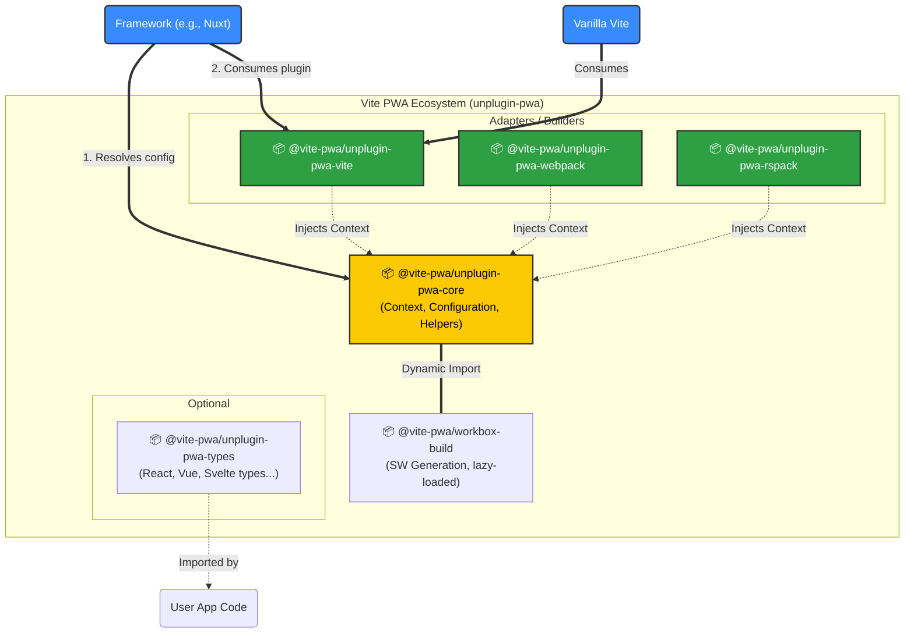
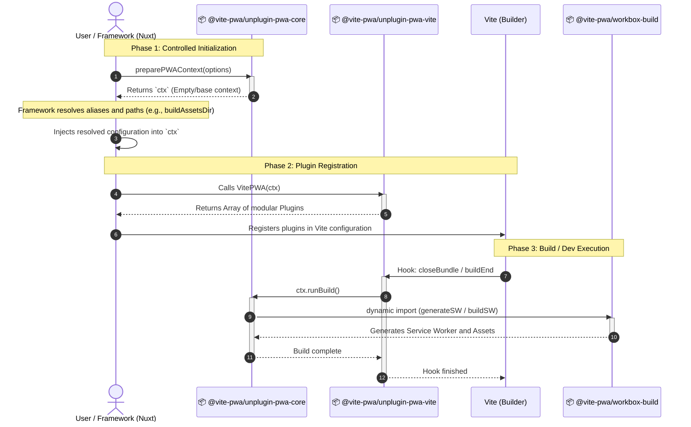

### The Architecture Diagram

```mermaid
graph TD
    subgraph Monorepo ["Vite PWA Ecosystem (unplugin-pwa)"]
        direction TB

        Core["📦 @vite-pwa/unplugin-pwa-core<br/>(Context, Configuration, Helpers)"]
        WB["📦 @vite-pwa/workbox-build<br/>(SW Generation, lazy-loaded)"]

        subgraph Builders ["Adapters / Builders"]
            direction LR
            Vite["📦 @vite-pwa/unplugin-pwa-vite"]
            Webpack["📦 @vite-pwa/unplugin-pwa-webpack"]
            Rspack["📦 @vite-pwa/unplugin-pwa-rspack"]
        end

        subgraph Extras ["Optional"]
            direction LR
            Client["📦 @vite-pwa/unplugin-pwa-types<br/>(React, Vue, Svelte types...)"]
        end

    %% Internal Relations
        Vite -. "Injects Context" .-> Core
        Webpack -. "Injects Context" .-> Core
        Rspack -. "Injects Context" .-> Core

        Core == "Dynamic Import" === WB
    end

%% External Consumers
    Nuxt("Framework (e.g., Nuxt)") ==>|1. Resolves config| Core
    Nuxt ==>|2. Consumes plugin| Vite
    Vanilla("Vanilla Vite") ==>|Consumes| Vite
    Client -. "Imported by" .-> App("User App Code")

    classDef core fill:#fbca04,stroke:#333,stroke-width:2px,color:black;
    classDef builder fill:#2ea043,stroke:#333,stroke-width:2px,color:white;
    classDef framework fill:#388bfd,stroke:#333,stroke-width:2px,color:white;

    class Core core;
    class Vite,Webpack,Rspack builder;
    class Nuxt,Vanilla framework;
```

### The Lifecycle Diagram (Execution Flow)

```mermaid
sequenceDiagram
    autonumber
    actor Dev as User / Framework (Nuxt)
    participant Core as 📦 @vite-pwa/unplugin-pwa-core
    participant Builder as 📦 @vite-pwa/unplugin-pwa-vite
    participant Vite as Vite (Builder)
    participant WB as 📦 @vite-pwa/workbox-build

    Note over Dev, Core: Phase 1: Controlled Initialization
    Dev->>Core: preparePWAContext(options)
    activate Core
    Core-->>Dev: Returns `ctx` (Empty/base context)
    deactivate Core

    Note over Dev: Framework resolves aliases and paths (e.g., buildAssetsDir)
    Dev->>Dev: Injects resolved configuration into `ctx`

    Note over Dev, Vite: Phase 2: Plugin Registration
    Dev->>Builder: Calls VitePWA(ctx)
    activate Builder
    Builder-->>Dev: Returns Array of modular Plugins
    deactivate Builder
    Dev->>Vite: Registers plugins in Vite configuration

    Note over Vite, WB: Phase 3: Build / Dev Execution
    Vite->>Builder: Hook: closeBundle / buildEnd
    activate Builder
    Builder->>Core: ctx.runBuild()
    activate Core
    Core->>WB: dynamic import (generateSW / buildSW)
    activate WB
    WB-->>Core: Generates Service Worker and Assets
    deactivate WB
    Core-->>Builder: Build complete
    deactivate Core
    Builder-->>Vite: Hook finished
    deactivate Builder
```

[MIT](./LICENSE) License &copy; 2026-PRESENT [Anthony Fu](https://github.com/antfu)