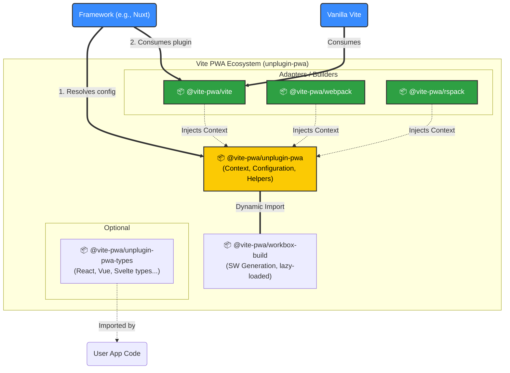
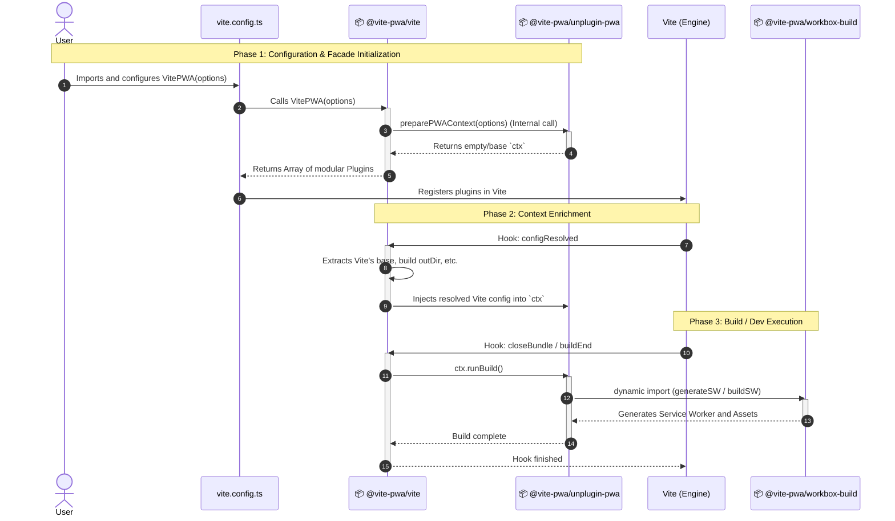
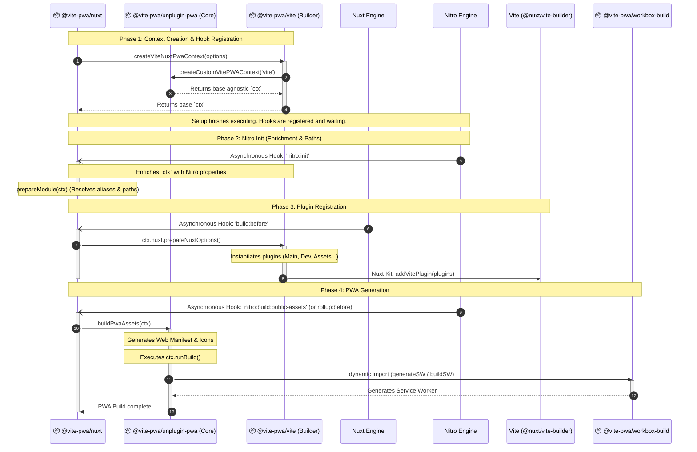

### The Architecture Diagram

### Vanilla Vite Lifecycle Diagram (Execution Flow)

### Nuxt + Vite Lifecycle Diagram (Execution Flow)

> [!NOTE]
> **On Lifecycle Execution:**
> While the sequence diagram represents a chronological flow, it is important to understand that the architecture is highly **event-driven**. During Phase 1, the Nuxt Module (`@vite-pwa/nuxt`) only resolves the initial context and registers the lifecycle hooks. The execution is not blocking or strictly sequential thereafter. Phases 2, 3, and 4 are executed asynchronously in complete isolation whenever the underlying Nuxt and Nitro engines reach those specific milestones in their internal build processes.

## 📄 License

[MIT](./LICENSE) License &copy; 2026-PRESENT [Anthony Fu](https://github.com/antfu)