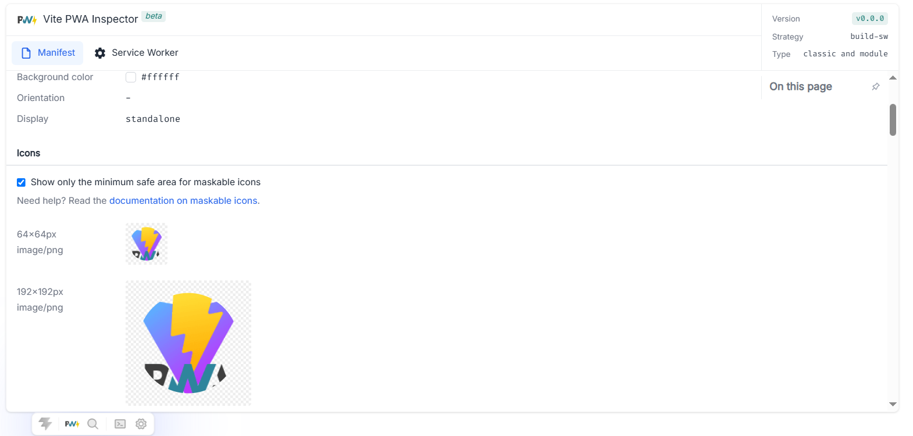
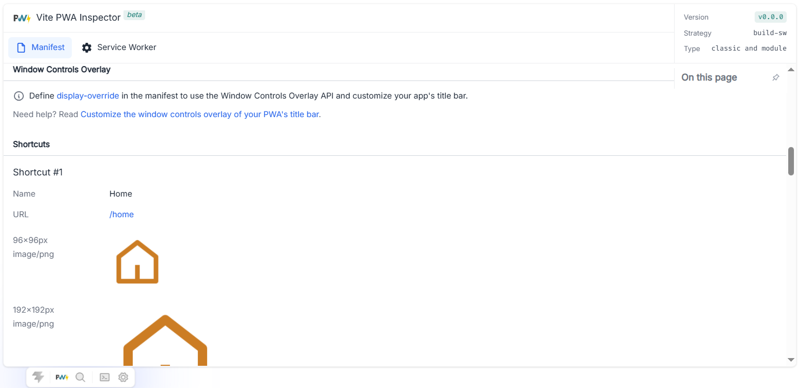
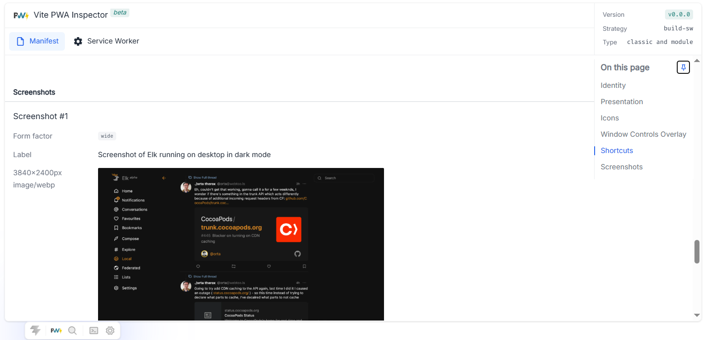
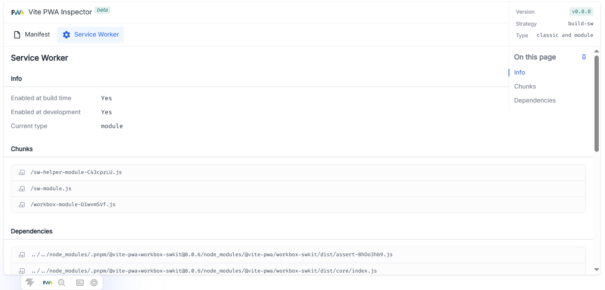

    

<h1 align="center">unplugin-pwa/inspector</h1>

## 🛠️ Welcome to unplugin-pwa/inspector

The ultimate visual inspector for your Progressive Web App. `@unplugin-pwa/inspector` is a standalone SPA (built with Vite) designed to demystify and visualize everything happening under the hood of your PWA configuration.

Forget about diving into terminal logs or triggering blind builds just to check if your Service Worker was generated correctly. With this inspector, you get an elegant GUI to audit your web manifest, review Workbox strategies, and check generated assets in real-time.

It integrates seamlessly with your bundler via the `@unplugin-pwa/core` package, which locates and serves the built-in inspector SPA dynamically, and includes out-of-the-box support for Anthony Fu's **DevFrame**.

### ✨ Key Features

* 📦 **Configuration Explorer:** Check exactly how your final PWA configuration has been resolved.
* 📱 **Web Manifest Preview:** Inspect metadata, icons, and colors exactly as the browser will interpret them.
* ⚙️ **Service Worker Audit:** Analyze caching strategies, precached routes, and Workbox integration at a glance.
* 🖼️ **DevFrame Support:** Fully compatible with [DevFrame](https://github.com/devframes/devframe) for a native DevTools experience.
* 🔌 **Standalone SPA:** A lightweight interface served directly from the `dist` output by the core package resolver.

### 📸 UI Sneak Peek

 

 

 

 

## 📄 License

[MIT](./LICENSE) License &copy; 2026-PRESENT [Anthony Fu](https://github.com/antfu)